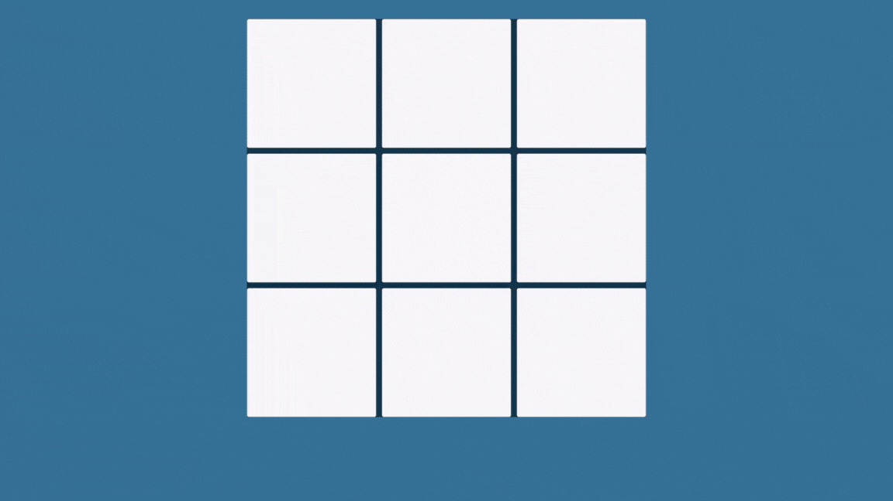

# Jogo da Velha com Arquitetura Avançada em Unity



## 🎯 Sobre o Projeto

Este não é apenas um simples Jogo da Velha. É um estudo prático sobre a aplicação de princípios avançados de arquitetura de software e design patterns no desenvolvimento de jogos com Unity e C#.

O objetivo principal não era criar uma mecânica de jogo complexa, mas sim construir uma mecânica simples sobre uma fundação de código robusta, escalável e de fácil manutenção, demonstrando práticas que são essenciais para projetos de grande escala.

## ✨ Destaques da Arquitetura e Boas Práticas

Este projeto foi construído sobre quatro pilares principais:

### 1. **Princípios SOLID**

Cada princípio foi uma diretriz para o design das classes:

* **S (Single Responsibility Principle):** A responsabilidade de cada classe é única e bem definida.
    * `GameManager`: Orquestra o estado e as regras do jogo.
    * `Board`: Modela os dados do tabuleiro, sem nenhuma lógica de jogo.
    * `AIPlayer`: Encapsula toda a lógica de decisão da Inteligência Artificial.
    * `BoardUI`, `WinLineController`, `UIManager`: Controladores de UI que apenas reagem a eventos e atualizam a visão, sem conter lógica de estado.
* **O (Open/Closed Principle):** O sistema é aberto para extensão, mas fechado para modificação. O melhor exemplo é o sistema de verificação de vitória.
* **L (Liskov Substitution Principle):** Embora não tenha hierarquias complexas, a estrutura está pronta para, por exemplo, ter múltiplos tipos de `IPlayer` (Humano, IA Fácil, IA Difícil) que podem ser substituídos sem quebrar a lógica.
* **I (Interface Segregation Principle):** As interfaces, como `IWinCondition`, são pequenas e focadas em um único propósito.
* **D (Dependency Inversion Principle):** A lógica de alto nível (`GameManager`) não depende de implementações de baixo nível. Ela depende de abstrações (`IWinCondition`).

### 2. **Padrão de Projeto: Strategy**

A verificação de vitória é implementada com o Padrão Strategy.
* A interface `IWinCondition` define um contrato `IsSatisfied()` e `GetWinLine()`.
* Classes concretas como `RowWinCondition`, `ColumnWinCondition`, e `MainDiagonalWinCondition` implementam essa interface.
* O `GameManager` mantém uma lista de `IWinCondition` e as testa em sequência, sem precisar conhecer os detalhes de cada uma. Isso torna o sistema extremamente flexível para adicionar novas condições de vitória no futuro.

### 3. **Arquitetura Orientada a Eventos**

A comunicação entre a lógica do jogo e a camada de visualização (UI) é completamente desacoplada usando eventos C# (`Action` e `event`).
* O `GameManager` atua como um *broadcaster*, anunciando eventos importantes: `OnGameStarted`, `OnMoveMade`, `OnPlayerTurnChanged`, `OnGameWon`, `OnGameDraw`.
* Sistemas de UI (`BoardUI`, `WinLineController`, `UIManager`) e a `AIPlayer` atuam como *listeners*, inscrevendo-se nesses eventos e reagindo quando eles são disparados.
* Isso significa que pode ser alterado completamente a UI ou adicionar um sistema de áudio sem modificar uma única linha do `GameManager`.

### 4. **Clean Code**

Foram aplicadas práticas de código limpo para garantir legibilidade e manutenibilidade:
* **Nomenclatura Clara:** Variáveis, métodos e classes têm nomes que revelam seu propósito.
* **Funções Pequenas:** Cada método tem uma responsabilidade única e é curto.
* **Estrutura de Projeto:** O projeto no Unity é organizado em pastas que separam claramente a lógica, a UI, os prefabs, as cenas e outros assets.

## 📁 Estrutura do Projeto

```
Assets/
    ├── Prefabs
    ├── Scenes
    └── Scripts/
        ├── Core/         (GameManager, Player)
        ├── Game/         (AIPlayer, Board, AntiDiagonalWinCondition, ColumnWinCondition, FullBoardDrawCondition RowWinCondition, WinLine)
        ├── Interface/    (IDrawCondition, IWinCondition)
        └── UI/           (BoardUI, CellUI, UIManager, WinLineController)
    └── Sprites   
```

## 🚀 Como Executar

1.  Clone este repositório: [Jogo da Velha](https://github.com/geisonsile/tictactoe.git)
2.  Abra a pasta do projeto com o Unity 6.0 ou superior.
3.  Abra a cena principal localizada em `Assets/Scenes/Game`.
4.  Pressione **Play** no editor.